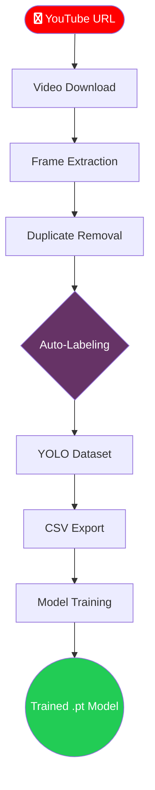

# 🎮 Game Vision Factory

[](https://www.python.org/)
[](https://docs.ultralytics.com/)
[](https://streamlit.io/)
[](https://opensource.org/licenses/MIT)

**Automated Gameplay Video → YOLO Dataset → CSV → Trainable Model**

Game Vision Factory is an end-to-end computer vision data pipeline that transforms raw gameplay videos into YOLO-formatted datasets, CSV annotations, and trainable object detection models — **without manual labeling.**

---

## 📌 Why This Project Exists
In most computer vision projects, the biggest challenge is not the model — it is **data availability and preparation.**

> [!CAUTION]
> **The Real Problem:**
> * No domain-specific datasets exist for most games.
> * Manual annotation is slow, expensive, and impractical.
> * Dataset engineering usually takes 80% of the project time.

Game Vision Factory addresses this gap by automating the entire pipeline, enabling faster iteration and feasibility testing.

---

## 🧠 How It Works (The Pipeline)

Using **Weak Supervision**, the system leverages pretrained models to "teach" new models, bypassing the manual labeling bottleneck.

### 🧠 Pipeline Overview


## 🌟 Core Capabilities

    🎥 Smart Ingestion: Accepts YouTube URLs with local caching and resume-safe downloads.

    🧹 Data Distillation: Uses pixel-difference analysis to remove near-duplicate frames, ensuring high visual diversity.

    🧠 Auto-Annotation: Uses YOLOv8 to generate bounding boxes. No manual clicking required for early-stage prototypes.

    📦 Industry Standard Outputs: Generates full YOLO directory structures (data.yaml) and framework-agnostic CSVs.

    🌐 No-Code UI: Powered by Streamlit, allowing users to manage state and downloads through a browser.

## 📁 Project Structure

```text

├── app.py              # Streamlit UI & pipeline orchestration
├── requirements.txt    # Project dependencies
├── yolov8n.pt          # Pretrained model weights
├── pipeline/           # Core logic modules
│   ├── video.py        # YouTube download logic
│   ├── frames.py       # Frame extraction (FFmpeg)
│   ├── cleaning.py     # Redundancy removal
│   ├── labeling.py     # YOLO auto-labeling
│   ├── dataset.py      # YAML & CSV generation
│   └── train.py        # Training wrapper
├── data/               # Input/Output data storage
└── tests/              # Unit tests for pipeline
    ├── test_video.py
    ├── test_frames.py
    └── test_cleaning.py
```
## 🛠️ Technology Stack

| Category | Tools & Frameworks |
| :--- | :--- |
| **Computer Vision** |   |
| **Machine Learning** |   |
| **Media Processing** |  |
| **Interface** |  |
| **Language** |  |
| **Data Format** |   |

---

## 🚀 Getting Started

Follow these steps to set up the Game Vision Factory on your local machine.

**1. Clone & Environment:**
```text
git clone <repository-url>
cd <repository-directory>

Create a virtual environment**

python -m venv venv

Activate it**

On Windows:
venv\Scripts\activate

On Mac/Linux:
source venv/bin/activate
```
**2. Install FFmpeg (System Dependency)**
Since your pipeline uses FFmpeg for high-speed frame extraction, you must install it on your OS:

| OS | Installation Command / Instructions |
| :--- | :--- |
| **Windows** | Download from [gyan.dev](https://www.gyan.dev/ffmpeg/builds/), extract, and add the `bin` folder to your **System PATH**. |
| **macOS** | `brew install ffmpeg` |
| **Linux (Ubuntu)** | `sudo apt update && sudo apt install ffmpeg` |


**3. Install Python Packages**
```text
pip install --upgrade pip
pip install ultralytics opencv-python-headless streamlit yt-dlp pandas numpy torch torchvision
```
**[!TIP]**
*Use opencv-python-headless if you are running this on a server or Docker without a GUI. Use opencv-python if you need to pop up local windows for debugging!

**4. Launch the App**
```text
streamlit run app.py
```
**📄 Your requirements.txt**

-- ultralytics>=8.0.0
-- opencv-python
-- streamlit
-- yt-dlp
-- pandas
-- numpy


---
### 📦 Key Dependencies
* `ultralytics` : Core engine for running the **YOLOv8** object detection model.
* `opencv-python` : Handles all image manipulation and video frame buffering.
* `numpy` : High-performance numerical operations for frame cleaning logic.
* `torch` : The deep learning backend required for model training.
