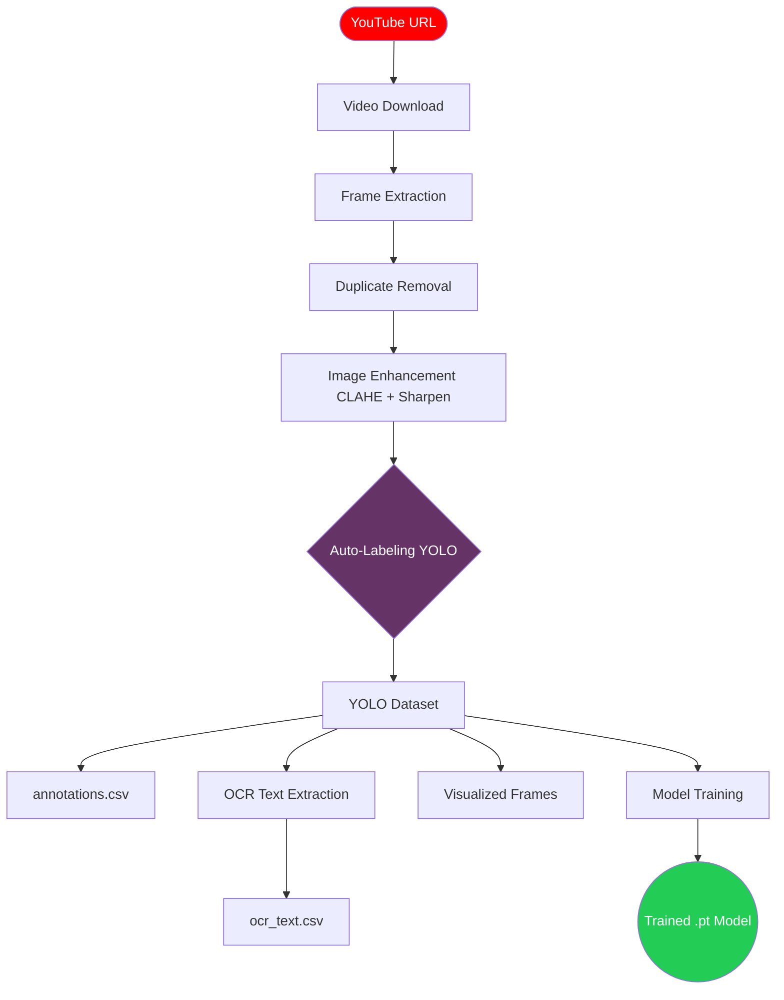

# 🎮 Game Vision Factory

[](https://www.python.org/)
[](https://docs.ultralytics.com/)
[](https://streamlit.io/)
[](https://opensource.org/licenses/MIT)

**Automated Gameplay Video → YOLO Dataset → CSV → Trainable Model**

Game Vision Factory is an end-to-end computer vision pipeline that turns raw gameplay videos into YOLO-formatted datasets, CSV annotations, OCR text extractions, and trainable object detection models — **without any manual labeling.**

---

## 📌 Why This Project Exists

In most computer vision projects, the biggest challenge is not the model — it is **data availability and preparation.**

> [!CAUTION]
> **The Real Problem:**
> * No domain-specific datasets exist for most games.
> * Manual annotation is slow, expensive, and impractical.
> * Dataset engineering usually takes 80% of the project time.

Game Vision Factory addresses this by automating the entire pipeline, enabling faster iteration and feasibility testing.

---

## 🧠 How It Works

Using **Weak Supervision**, the system leverages pretrained models to generate labels automatically, bypassing the manual labeling bottleneck.



---

## 🌟 Core Capabilities

- 🎥 **Smart Ingestion** — Accepts YouTube URLs with local caching and resume-safe downloads.
- 🧹 **Data Distillation** — Uses pixel-difference analysis to remove near-duplicate frames.
- 🖼️ **Image Enhancement** — Applies CLAHE contrast boosting and sharpening before detection so YOLO finds more objects in dark or blurry game scenes.
- 🧠 **Auto-Annotation** — Uses YOLOv8 to generate bounding boxes. No manual clicking required.
- 📝 **OCR Extraction** — Runs Tesseract on every frame to capture in-game text (scores, health, ammo, timers) and saves it to a separate CSV.
- 👁️ **Auto Visualization** — Draws bounding boxes on every frame automatically so you can visually confirm label quality.
- 📦 **Industry Standard Outputs** — Generates full YOLO directory structures with `data.yaml` and framework-agnostic CSVs.
- 🌐 **No-Code UI** — Powered by Streamlit for managing the full pipeline from a browser.

---

## 📁 Project Structure

```
├── app.py                   # Streamlit UI and pipeline orchestration
├── requirements.txt         # Python dependencies
├── yolov8n.pt               # Pretrained YOLO weights
├── visualise_labels.py      # Run manually: python visualise_labels.py <video_id>
├── pipeline/
│   ├── video.py             # YouTube download
│   ├── frames.py            # Frame extraction via FFmpeg
│   ├── cleaning.py          # Duplicate frame removal
│   ├── enhance.py           # CLAHE + sharpening before YOLO
│   ├── labeling.py          # YOLO auto-labeling
│   ├── dataset.py           # data.yaml + CSV generation + train/val split
│   ├── ocr.py               # Tesseract OCR on frames
│   ├── visualise_labels.py  # Draw bounding boxes on frames
│   └── train.py             # Model training wrapper
└── data/
    └── runs/
        └── <video_id>/
            ├── video.mp4
            ├── frames_raw/
            ├── frames_clean/
            ├── dataset/
            │   ├── data.yaml
            │   ├── images/train/
            │   ├── images/val/
            │   ├── labels/train/
            │   └── labels/val/
            ├── visualized/       ← bounding box preview frames
            ├── annotations.csv   ← YOLO labels as spreadsheet
            ├── ocr_text.csv      ← all in-game text detected
            └── yolo_dataset.zip  ← full dataset ready to share
```

---

## 📊 Output Files Explained

| File | What it contains | Who uses it |
|---|---|---|
| `annotations.csv` | Every bounding box with class name, coordinates, train/val split | Data analysis, non-YOLO frameworks |
| `ocr_text.csv` | Every piece of text found on screen with position and confidence | Game bots, HUD analytics, score tracking |
| `visualized/` | Frames with boxes drawn on them | Confirming label quality visually |
| `yolo_dataset.zip` | Complete YOLO dataset ready to train on | Anyone wanting to train a detector |

---

## 🛠️ Technology Stack

| Category | Tools |
|---|---|
| **Computer Vision** | YOLOv8, OpenCV |
| **Machine Learning** | PyTorch, Ultralytics |
| **OCR** | Tesseract, pytesseract |
| **Media Processing** | FFmpeg, yt-dlp |
| **Interface** | Streamlit |
| **Language** | Python 3.9+ |

---

## 🚀 Getting Started

**1. Clone and create virtual environment:**
```bash
git clone <repository-url>
cd <repository-directory>
python -m venv venv

# Windows
venv\Scripts\activate

# Mac/Linux
source venv/bin/activate
```

**2. Install FFmpeg:**

| OS | Command |
|---|---|
| Windows | Download from [gyan.dev](https://www.gyan.dev/ffmpeg/builds/), extract, add `bin` to PATH |
| macOS | `brew install ffmpeg` |
| Linux | `sudo apt install ffmpeg` |

**3. Install Tesseract:**

| OS | Command |
|---|---|
| Windows | Download from [UB Mannheim](https://github.com/UB-Mannheim/tesseract/wiki) |
| macOS | `brew install tesseract` |
| Linux | `sudo apt install tesseract-ocr` |

After installing, set the path in `pipeline/ocr.py`:
```python
pytesseract.pytesseract.tesseract_cmd = r"C:\Program Files\Tesseract-OCR\tesseract.exe"
```

**4. Install Python packages:**
```bash
pip install ultralytics opencv-python streamlit yt-dlp pandas numpy torch torchvision pytesseract pyyaml
```

**5. Launch:**
```bash
streamlit run app.py
```

---

## ✅ How to Confirm Dataset Quality

Run the visualizer on any completed video:
```bash
python pipeline/visualise_labels.py <video_id>
```

Open the `data/runs/<video_id>/visualized/` folder and check:

| Good signs ✅ | Bad signs ❌ |
|---|---|
| Tight boxes around objects | Boxes on empty background |
| Correct class labels | Wrong labels on objects |
| Most frames have detections | Most frames empty |
| Val folder has different images than train | Same images in train and val |

---

## 🤖 Training a Model on the Dataset

```python
from ultralytics import YOLO

model = YOLO("yolov8n.pt")

model.train(
    data="data/runs/<video_id>/dataset/data.yaml",
    epochs=50,
    imgsz=640
)
```

After training, use the model:
```python
trained_model = YOLO("runs/detect/train/weights/best.pt")
results = trained_model("any_game_screenshot.jpg")
```

---

## 📄 Requirements

```
streamlit
ultralytics
opencv-python
yt-dlp
pyyaml
pytesseract
numpy
torch
torchvision
```